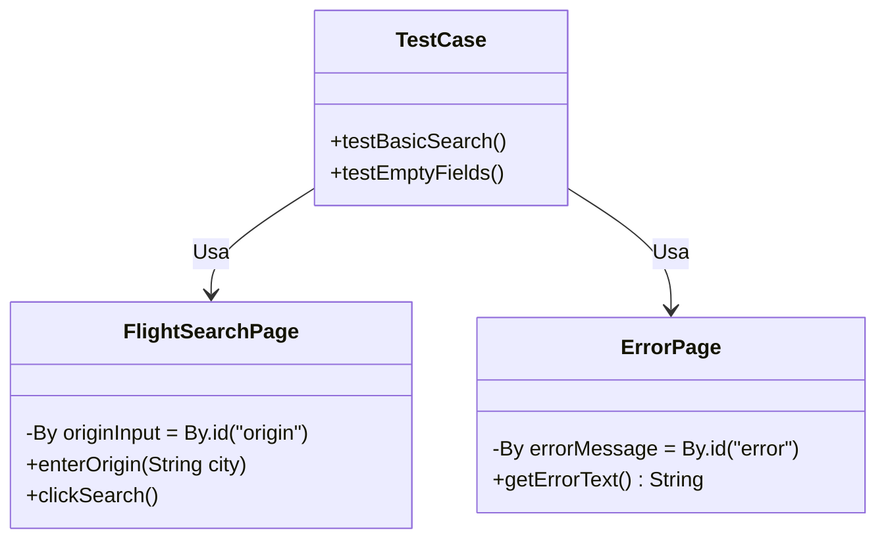
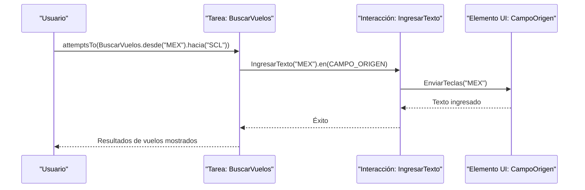
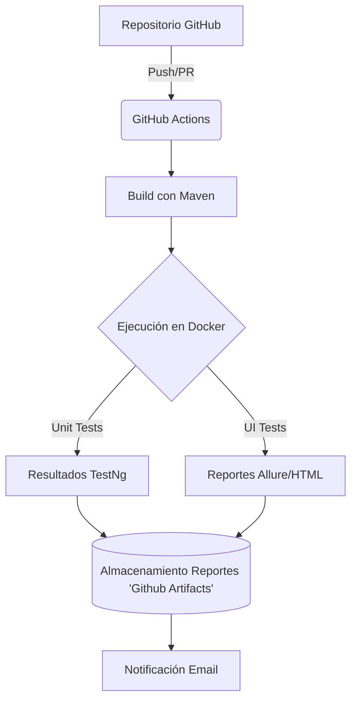

# Solución prueba técnica

## Casos de Prueba para Búsqueda de Vuelos en latamairlines.com

###  Caso de Prueba 1: Acceso a la sección de alojamientos

**Precondiciones**: 
1.  El ambiente de prueba está configurado con Playwright y el navegador Chrome/Firefox listo para ejecutarse
    
2.  El sitio web de  [LATAM Airlines](https://www.latamairlines.com/co/es) está disponible y accesible.
    
3.  El usuario no ha realizado ninguna búsqueda previa de alojamientos.

**Pasos**:

1.  Navegar a  [https://www.latamairlines.com/co/es](https://www.latamairlines.com/co/es)
    
2.  Buscar en el menú principal la opción "Alojamientos" o "Hoteles"
    
3.  Hacer clic en la opción encontrada
    

**Resultado esperado**:

✅La página de alojamientos se carga correctamente
    
✅Muestra un formulario de búsqueda con campos para destino, fechas de llegada y salida.

### Caso de Prueba 2: Validación de Campos Obligatorios
**Descripción**: Verificar que el sistema muestra el mensaje de error **"Ingresa un destino válido"** cuando el usuario intenta buscar alojamientos sin ingresar un destino.
**Precondiciones**:
1.  El ambiente de prueba está configurado con Playwright y el navegador Chrome/Firefox listo para ejecutarse
    
2.  El sitio web de LATAM Airlines ([https://www.latamairlines.com/co/es](https://www.latamairlines.com/co/es)) está disponible y accesible
    
3.  El usuario no ha realizado ninguna búsqueda previa de alojamientos
    
4.  La sección de alojamientos está activa y disponible para interacción

**Pasos**:
1.  Navegar al sitio web de [LATAM Airlines](https://www.latamairlines.com/co/es)
    
2.  Localizar y hacer clic en la pestaña de "Alojamientos"
    
3.  Verificar que el panel de búsqueda de alojamientos se muestra correctamente
    
4.  Asegurarse que el campo de destino esté vacío
    
5.  Hacer clic en el botón "Buscar alojamientos" 
    
6.  Esperar la aparición del mensaje de validación

**Resultados Esperados**:
1.  Después del paso 3: El panel de búsqueda de hoteles se carga y muestra correctamente todos sus elementos
    
2.  Después del paso 5: El sistema no muestra ningún resultado de búsqueda ni redirige a otra página
    
3.  Después del paso 6:
    
    -   El mensaje de error "Ingresa un destino válido" es claramente visible
        
    -   El mensaje aparece cerca del campo de destino
        
    -   El campo de destino puede mostrar un indicador visual de error (como borde rojo)
        
    -   El mensaje persiste hasta que el usuario comience a escribir un destino válido

### Caso de Prueba 3: Búsqueda de alojamiento exitosa
**Descripción**: Verificar que el sistema redirige correctamente a Booking.com después de realizar una búsqueda válida de alojamientos en LATAM Airlines.

**Precondiciones**:
1.  El ambiente de prueba está configurado con Playwright y el navegador Chrome/Firefox listo para ejecutarse
    
2.  El sitio web de [LATAM Airlines](https://www.latamairlines.com/co/es) está disponible y accesible
    
3.  El usuario no ha realizado ninguna búsqueda previa de alojamientos
    
4.  La sección de alojamientos está activa y disponible para interacción

**Pasos**:
1.  Navegar a página principal de LATAM Airlines  
    `GET https://www.latamairlines.com/co/es`
    
2.  Acceder a sección de alojamientos 
    
3.  Completar formulario:
    
    -   Ingresar destino: "Bogotá"
        
    -   Seleccionar opción: "Bogotá, Colombia"
        
    -   Establecer fecha check-in: [Fecha actual + 7 días]
        
    -   Establecer fecha check-out: [Fecha actual + 14 días]
        
4.  Iniciar búsqueda dando click en el botón buscar
    
5.  Esperar redirección  a [Booking.com](https://sp.booking.com/)

**Resultados Esperados**:
1.  Redirección completa a Booking.com:
    -   URL debe iniciar con  `https://sp.booking.com/`
        
    -   No debe mostrar errores de redirección

## Modulo de arquitectura

Recomendaria usar alguno de estos 3 patrones de diseño ***Page Object Model (POM)*** , ***ScreenPlay*** y *** ***Behavior-Driven Development (BDD)*** dependiendo de algunas consideraciones.

1. #### Cuando usar POM
	-    Equipos con  **experiencia técnica**  (QA o devs familiarizados con Selenium).
    
	- Proyectos  **pequeños/medianos**  con flujos simples.
    
	-   Cuando se necesita  **rápida implementación**  sin mucha curva de aprendizaje.

2.  #### Cuando usar Screenplay
	-   **Equipos que valoran legibilidad**: Cuando las pruebas deben ser comprensibles para no-técnicos (ej: product owners).
    
	-   **Proyectos complejos**: Con flujos de usuario multi-paso (ej: reserva de vuelos + selección de asientos + pago).
    
	-   **Reutilización de código**: Para compartir pasos comunes entre múltiples pruebas.
3. #### Cuando usar BDD
	-   **Colaboración con áreas de negocio**: Cuando POs o stakeholders deben validar criterios de aceptación.
    
	-   **Documentación viva**: Para generar informes legibles que sirvan como especificación.
    
	-   **Proyectos ágiles**: Donde los requisitos cambian frecuentemente.

###  Diagramas

#### Page object model (POM)

#### Screanplay

Para la prueba se decide implementar el patrón Page Object Model (POM) debido a su rápida implementación y la experiencia técnica, la herrienta seleccionada para implementar las pruebas es [Playwright](https://playwright.dev/), como SUITE de pruebas se selecciona TestNG debido a la experiencia tecnica.

## Modulo DevOps
#### **1. Estrategia de Despliegue y Ejecución**

-   Usar  **GitHub Actions**, es gratis y fácil de usar.
    
-   Ejecutar  **pruebas unitarias al hacer  `git push`
    
-   Las  **UI Tests**  que corran de noche (son lentas).
    
-   Guardar  **evidencias en GitHub Artifacts** despues migrar a **AWS S3**

#### **2. Cantidad de Pipelines**
Se recomienda implementar al menos **tres pipelines** para una gestión eficiente del flujo de desarrollo:

1.  **Build Pipeline**: Responsable de la construcción del proyecto y la ejecución de pruebas unitarias, garantizando la calidad del código en una etapa temprana.
    
2.  **UI Pipeline**: Encargado de ejecutar pruebas de interfaz de usuario (UI) para validar la funcionalidad y experiencia del usuario.
    
3.  **Deploy Pipeline**: Destinado al despliegue en producción, asegurando una transición segura y controlada del código a entornos finales.

#### **3. Dónde Correr Cada Prueba**
Las pruebas unitarias se ejecutarán en el **Build Pipeline** cada vez que se realice un **push** al repositorio, permitiendo una validación temprana del código. Por otro lado, las pruebas de UI se llevarán a cabo en el **UI Pipeline** y se programarán para ejecutarse durante la noche, ya que su tiempo de ejecución es mayor.

#### **4. Pruebas Extra para Agregar**

Se podrian agregar las siguientes pruebas.
1. Pruebas de rendimiento, en su propio pipelien (Rendimiento)

#### **5. Plantamiento de arquitectura**
La integración y entrega continua (CI/CD) se gestionará a través de **GitHub Actions**, permitiendo la automatización de pruebas y despliegues. **Maven** se utilizará para la compilación y gestión de dependencias del proyecto. Las pruebas se ejecutarán en entornos aislados mediante **Docker**, asegurando consistencia y reproducibilidad. Los reportes generados durante la ejecución de las pruebas se almacenarán en **GitHub Artifacts**, facilitando su acceso y análisis.

